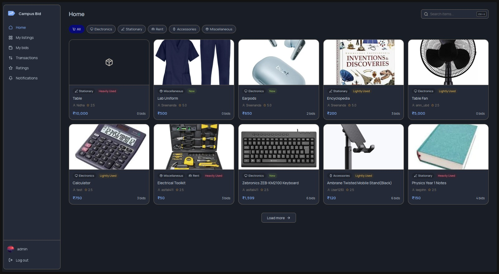
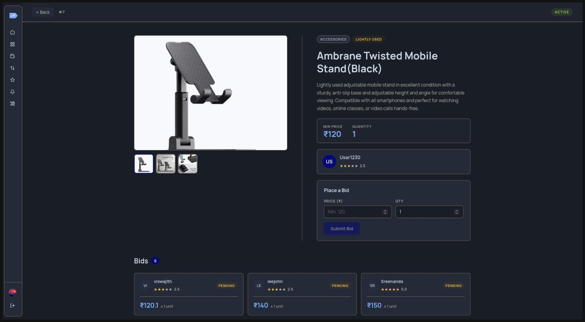
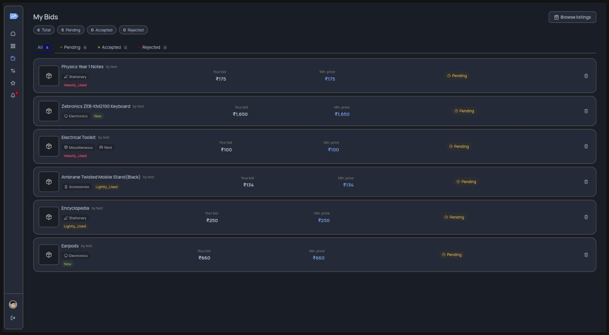

# E-Commerce Website

A modern, full-featured e-commerce platform built with React, TypeScript, and Vite. This application provides a seamless shopping experience with real-time bidding, user authentication, and administrative capabilities.

## 🎨 Preview



## 🚀 Features

- **User Authentication**: Secure login and registration system
- **Item Management**: Create, edit, and manage product listings
- **Bidding System**: Real-time bidding functionality for auctions
- **User Transactions**: Track purchase and sale history
- **Ratings & Reviews**: User feedback and rating system
- **User Profiles**: Comprehensive user profile management with avatar customization
- **Notifications**: Real-time notification system for user activities
- **Advanced Filtering**: Category-based filtering and search capabilities
- **Responsive Design**: Mobile-friendly interface with smooth animations
- **Error Handling**: Comprehensive error handling with dedicated error pages

## 🛠️ Tech Stack

### Frontend Framework
- **React** 19 - UI library
- **TypeScript** - Type-safe JavaScript
- **Vite** - Next-generation build tool
- **React Router DOM** - Client-side routing

### Styling & Animation
- **CSS Modules** - Component-scoped styling
- **Framer Motion** - Advanced animations and interactions

### State Management & API
- **Context API** - State management
- **Axios** - HTTP client for API requests

### UI Components & Libraries
- **Untitled UI Icons** - Icon library
- **Recharts** - Data visualization and charts
- **React Easy Crop** - Image cropping functionality
- **React Hotkeys Hook** - Keyboard shortcuts support

### Development Tools
- **ESLint** - Code linting
- **TypeScript ESLint** - TypeScript-specific linting

## 📁 Project Structure

```
src/
├── components/                  # Reusable UI components
│   ├── avatarDialog/            # Avatar management dialog
│   ├── categoryDropdown/        # Category filtering
│   ├── dialog/                  # Generic dialog component
│   ├── dropdown/                # Filter dropdown
│   ├── itemCard/                # Product card component
│   ├── itemDialog/              # Item management dialog
│   ├── logo/                    # Logo component
│   ├── nav/                     # Navigation bar
│   ├── reportDialog/            # Report submission dialog
│   ├── spinner/                 # Spinner loader
│   ├── toast/                   # Notification toast
│   └── transactionDialog/       # Transaction details dialog
├── context/                     # React Context providers
│   ├── ActionProvider.tsx       # Global actions
│   ├── AdminProvider.tsx        # Admin state
│   ├── AuthProvider.tsx         # Authentication state
│   ├── NotificationProvider.tsx # Notifications
│   └── SettingProvider.tsx      # Settings
├── pages/                       # Page components
│   ├── adminPanel/              # Admin dashboard
│   ├── createItem/              # Create new listing
│   ├── editItem/                # Edit existing listing
│   ├── error/                   # Error pages (404, 500)
│   ├── forgotPassword/          # Forgot password page
│   ├── home/                    # Home page
│   ├── itemDetail/              # Product details
│   ├── login/                   # Login page
│   ├── myBids/                  # User bids page
│   ├── myListings/              # User listings
│   ├── notifications/           # Notifications page
│   ├── profile/                 # User profile
│   ├── ratings/                 # Ratings & reviews
│   ├── reportItemDetail/        # Report details
│   ├── signup/                  # Registration page
│   └── transactions/            # Transaction history
├── routing/                     # Route configuration
├── global/                      # Global utilities
│   ├── icons.ts                 # Icons
│   ├── request.ts               # API request configuration
│   ├── schema.ts                # Data schemas/types
│   ├── types.ts                 # TypeScript type definitions
│   └── var.tsx                  # Global variables
└── App.tsx                      # Root component
```

## 🚀 Getting Started

### Prerequisites
- Node.js (v16 or higher)
- npm or yarn

### Installation

1. **Clone the repository**
   ```bash
   git clone "https://github.com/asifali411/E-commerce-website.git"
   cd e-commerce-website
   ```

2. **Install dependencies**
   ```bash
   npm install
   ```

3. **Start the development server**
   ```bash
   npm run dev
   ```

4. **Open your browser** and navigate to `http://localhost:5173`

## 📝 Available Scripts

### Development
```bash
npm run dev
```
Starts the development server with hot module reloading (HMR). The application will be available at `http://localhost:5173`.

### Build
```bash
npm run build
```
Compiles TypeScript and builds the production-ready bundle. Output is generated in the `dist/` directory.

### Preview
```bash
npm run preview
```
Preview the production build locally before deployment.

### Linting
```bash
npm run lint
```
Run ESLint to check code quality and identify potential issues.

## 📚 Key Components

### Context Providers
- **AuthProvider**: Manages user authentication state and login/logout
- **AdminProvider**: Manages admin-specific state and permissions
- **NotificationProvider**: Handles real-time notifications
- **ActionProvider**: Manages global application actions

### Pages
- **Home**: Landing page with product listings
- **Login/SignUp**: User authentication pages
- **ItemDetail**: Detailed view of a product with bidding
- **MyListings**: User's product listings management
- **MyBids**: User's active bids and auction participation
- **AdminPanel**: Administrative controls and management
- **Transactions**: Purchase and sale history

## 🎯 Features by Section

### E-Commerce Core
- Browse and search products by category
- View detailed item information
- Place bids on auction items
- Purchase items directly

### User Management
- User registration and authentication
- Profile customization with avatar upload
- User ratings and reviews
- Transaction history tracking

### Admin Features
- Manage product listings
- Monitor user activities
- Handle reports and disputes
- View platform analytics

## 🎨 Screenshots




## 🤝 Contributing

Contributions are welcome! To contribute:

1. Create a feature branch (`git checkout -b feature/AmazingFeature`)
2. Commit your changes (`git commit -m 'Add AmazingFeature'`)
3. Push to the branch (`git push origin feature/AmazingFeature`)
4. Open a Pull Request

## 📄 License

This project is private. Contact the project owner for usage rights.

## 🐛 Known Issues & Roadmap

- [ ] Add unit and integration tests
- [ ] Implement infinite scroll for product listings
- [ ] Add payment gateway integration
- [ ] Enhance search with full-text search capabilities
- [ ] Add email notifications
- [ ] Implement real-time chat between users

## 📧 Support

For support, please contact the development team or open an issue in the repository.

---

**Last Updated**: April 2026
